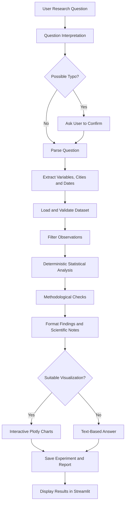
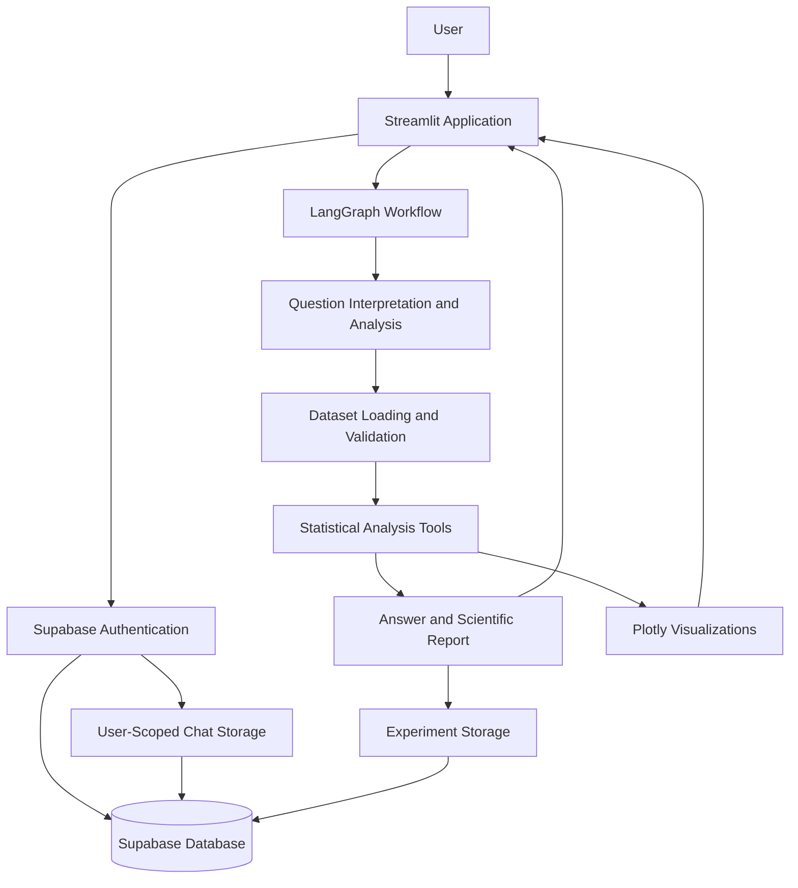

# Autonomous Climate Scientist 🌦️

**A data-driven climate research application for natural-language querying, statistical analysis, interactive visualization, and reproducible experiment reporting.**

Autonomous Climate Scientist lets users investigate historical weather patterns across ten Indian cities through natural-language questions. It interprets temporal constraints, validates the available data, performs deterministic statistical analyses, generates relevant visualizations, and produces structured scientific reports.

The application combines Python-based scientific computing with LangGraph workflow orchestration, a Streamlit interface, and Supabase-backed authentication and persistent user-scoped storage.

## Overview

Climate data analysis involves more than calculating statistics. Research questions must be translated into appropriate time intervals, mapped to available variables, analyzed without misleading aggregation, and reported with methodological limitations.

This project brings these steps into one interactive research workflow.

### Key Features

- **Natural-language analysis:** Interpret climate questions and identify relevant variables, cities, and temporal constraints.
- **Precise temporal filtering:** Support calendar years, inclusive year ranges, individual months, exact dates, and full-dataset queries.
- **Multi-city analysis:** Analyze ten Indian cities separately when a question does not specify a particular location.
- **Statistical methods:** Calculate descriptive statistics, linear trends, monthly and seasonal summaries, correlations, and seasonal-anomaly sensitivity analyses.
- **Interactive visualization:** Generate question-specific Plotly charts with date, month, season, and city filters where applicable.
- **Data quality checks:** Inspect missing values, duplicate city/date records, date validity, and available metadata.
- **Question clarification:** Suggest potential spelling corrections and request confirmation before using them.
- **Scientific reporting:** Generate concise answers, methodological notes, and downloadable Markdown reports.
- **Experiment provenance:** Store experiment records separately from chat messages.
- **User-specific persistence:** Integrate Supabase authentication and row-level security for private chat and experiment storage.
- **Reproducible computation:** Use deterministic Python functions for numerical analysis.

## Architecture

### Research workflow



### Application architecture



The workflow is implemented using LangGraph with a direct Python fallback. Scientific calculations are performed by deterministic analysis functions.

## Dataset

The active dataset is [`india_2000_2024_daily_weather.csv`](india_2000_2024_daily_weather.csv).

| Property | Description |
|---|---|
| Temporal coverage | January 2000 – December 2024 |
| Observations | 91,320 daily records |
| Locations | 10 Indian cities |
| Data granularity | Daily |
| Data quality | No missing values or duplicate city/date records in the inspected snapshot |
| Date semantics | Date-only source values, interpreted using calendar boundaries without shifting the stored dates |

**Cities covered:** Ahmedabad, Bangalore, Chennai, Delhi, Hyderabad, Jaipur, Kolkata, Lucknow, Mumbai, and Pune.

### Available variables

- `temperature_2m_max`
- `temperature_2m_min`
- `apparent_temperature_max`
- `apparent_temperature_min`
- `precipitation_sum`
- `rain_sum`
- `weather_code`
- `wind_speed_10m_max`
- `wind_gusts_10m_max`
- `wind_direction_10m_dominant`

The source CSV does not specify measurement units, provider provenance, coordinates, or a weather-code legend. The application does not invent this missing metadata.

An Open-Meteo CSV is also present in the repository, but the current application code enables the India multi-city daily dataset only.

## Temporal Query Handling

The application applies calendar boundaries according to the dates specified in the question.

| Example question | Analysis period |
|---|---|
| What was the rainfall in 2020? | January–December 2020 |
| Compare rainfall from 2018 to 2022 | January 2018–December 2022, inclusive |
| Analyze March 2020 | March 1–31, 2020 |
| Analyze weather on June 15, 2020 | June 15, 2020 only |
| Compare temperature trends | Full available period unless otherwise specified |

Requests outside the available coverage are handled according to dataset availability rather than silently extrapolating observations.

## Scientific Analysis

The analysis layer provides:

- Descriptive statistics for selected variables
- Linear trend estimation
- Monthly and seasonal statistics
- Correlation analysis
- Seasonal-anomaly correlation analysis
- City-specific and city-comparison analysis
- Date-filtered analysis frames
- Data-quality and methodological checks

The application treats the data as observational. Correlation is not interpreted as causation, and city records are not combined into a misleading national time series.

## Technology Stack

| Layer | Technologies |
|---|---|
| Language | Python |
| Workflow orchestration | LangGraph |
| Data processing | Pandas |
| Scientific computing | SciPy |
| Visualization | Plotly, Matplotlib |
| Web application | Streamlit |
| Authentication | Supabase Auth |
| Persistence | Supabase / PostgreSQL |
| Database security | Row-level security (RLS) |
| Python packaging | `pyproject.toml`, Setuptools |

## Project Structure

```text
autonomous-climate-scientist/
├── app/
│   └── streamlit_app.py
│
├── src/
│   └── climate_scientist/
│       ├── __init__.py
│       ├── __main__.py
│       ├── agent.py
│       ├── chat_store.py
│       ├── data.py
│       ├── plotly_visualizations.py
│       ├── question_check.py
│       ├── science.py
│       ├── supabase_auth.py
│       ├── time_range.py
│       ├── visualization.py
│       └── workflow.py
│
├── supabase/
│   └── schema.sql
│
├── streamlit/
│   └── config.toml
│
├── india_2000_2024_daily_weather.csv
├── .env.example
├── .gitignore
├── pyproject.toml
├── requirements.txt
└── README.md

```

### Main Components

| File | Responsibility |
|---|---|
| `agent.py` | Question interpretation, experiment planning, analysis coordination, critique, and reporting |
| `workflow.py` | LangGraph workflow orchestration and Python fallback |
| `data.py` | Dataset loading, discovery, metadata, and validation |
| `science.py` | Deterministic statistical calculations and analysis preparation |
| `time_range.py` | Interpretation of years, ranges, months, and exact dates |
| `question_check.py` | Conservative spelling suggestions requiring user confirmation |
| `plotly_visualizations.py` | Interactive, question-specific charts and city coverage map |
| `visualization.py` | Static visualization utilities for experiment records |
| `chat_store.py` | User-scoped conversations and separate experiment persistence |
| `supabase_auth.py` | Supabase client initialization and session restoration |
| `app/streamlit_app.py` | User interface, authentication, chat interaction, and chart rendering |
| `supabase/schema.sql` | Database tables, indexes, and row-level security policies |

## Installation

### Prerequisites

- Python 3.10 or a compatible version supported by the installed dependencies
- Git
- A Supabase project for authentication and persistent user-specific storage

### 1. Clone the repository

```bash
git clone https://github.com/<your-username>/autonomous-climate-scientist.git
cd autonomous-climate-scientist
```

### 2. Create a virtual environment

**Windows PowerShell**

```powershell
python -m venv .venv
.\.venv\Scripts\Activate.ps1
```

**Linux/macOS**

```bash
python -m venv .venv
source .venv/bin/activate
```

### 3. Install dependencies

```bash
python -m pip install -r requirements.txt
```

### 4. Configure Supabase

Create a local `.env` file from `.env.example` and configure:

```toml
SUPABASE_URL = "https://your-project.supabase.co"
SUPABASE_PUBLISHABLE_KEY = "your-publishable-key"
```

Run the SQL script in `supabase/schema.sql` in the Supabase SQL Editor to create the required tables and security policies.

Use the same variables in Streamlit Community Cloud's app secrets when deploying.


### 5. Launch the application

```bash
streamlit run app/streamlit_app.py
```

The application is available at the local URL displayed by Streamlit, usually `http://localhost:8501`.

## Screenshots and Demo

Add your own screenshots to `docs/images/` and replace the placeholders below.

### Application Interface


### Climate Analysis and Visualizations


### Interactive Filters


**Live application:** [Open the deployed app](<https://climate-science-agent-pqtbewy8xsmjyjobeboy8c.streamlit.app/>)

**Demo video:** [Watch the project walkthrough](<YOUR_DEMO_VIDEO_URL>)
) for the project's licensing terms.
